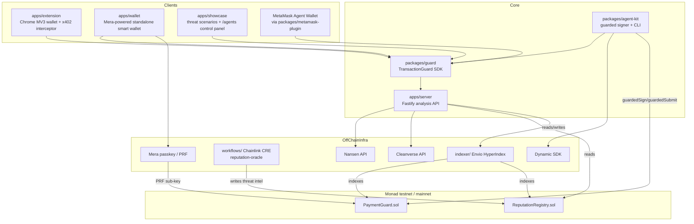

# Baret — System Architecture

> This document is the **target architecture** for the Baret implementation to be written from scratch for Monad Metropolis (no code yet). As code starts being written, this file must be kept in sync with the code — if a contradiction is found, the source code is treated as the authority and this file is updated.

Last updated: 2026-09-13 · Status: **Design phase**

---

## 1. Design Principles

1. **Monad only.** No file contains an "any EVM chain" / "point at any chain" generalization. `chain.ts` (or its equivalent) has exactly two entries: `testnet` (10143) and `mainnet` (143). No other chain's name appears anywhere.
2. **Fail-closed.** When there is insufficient data (simulation failed, account state missing), the decision falls on the **block** side, not "allow".
3. **SDKs can be consumed independently of the chain library.** Packages such as `@baret/guard` must be consumable without importing `ethers`/`viem` — wallet UIs should stay lightweight.
4. **Sponsor integrations are inside the product, not a separate "demo mode".** The Nansen, Cleanverse, Mera, Dynamic and Envio integrations are part of the main analysis flow; when switched off, the product genuinely loses capability.
5. **The policy belongs to the user, the engine to Baret.** `GuardPolicy` is carried entirely as data (JSON); the engine code interprets the policy but is not embedded in it.

---

## 2. High-Level Component Diagram



---

## 3. Monorepo Layout

```
baret/
├── apps/
│   ├── server/        Fastify + TypeScript analysis API (the heart of the engine)
│   ├── wallet/        Standalone smart wallet demo running on Mera passkeys
│   ├── extension/     Chrome MV3 (+ Firefox if possible) browser extension
│   └── showcase/      Threat scenario gallery + /agents control page
├── packages/
│   ├── guard/             @baret/guard — TransactionGuard + GuardPolicy SDK
│   ├── agent-kit/         @baret/agent-kit — guarded signer (Dynamic-backed) + CLI
│   ├── metamask-plugin/   MetaMask Agent Wallet plugin package for the Baret firewall
│   ├── wallet-adapter/    dApp ↔ wallet postMessage bridge
│   ├── ext-protocol/      Extension message-bus types
│   ├── ui/                Design tokens + shared React components
│   └── showcase-ui/       Shared UI skeleton for showcase sites
├── contracts/         Foundry — PaymentGuard.sol, ReputationRegistry.sol
├── workflows/         Chainlink CRE — reputation-oracle workflow
├── indexer/           Envio HyperIndex config + handlers
├── docs/              This documentation set
├── pnpm-workspace.yaml
└── docker-compose.yml / render.yaml / vercel.json (deploy config)
```

**Technology choices:**
- **Fastify** — API server (TypeScript).
- **ethers.js or viem** — Monad RPC interaction (decision: to be settled in `DECISIONS.md`).
- **Zod** — env and request schema validation.
- **Foundry** — contract development/test/deploy.
- **React + Vite** — wallet/extension/showcase UIs.
- **Envio HyperIndex** — on-chain event indexing (GraphQL query surface).

---

## 4. Chain Configuration (Monad ONLY)

```ts
// apps/server/src/config/chains.ts — target shape
export const CHAINS = {
  testnet: {
    chainId: 10143,
    rpcUrl: process.env.MONAD_TESTNET_RPC_URL, // Alchemy primary
    explorerUrl: "https://testnet.monadexplorer.com",
    nativeSymbol: "MON",
    nativeDecimals: 18,
    usdcAddress: process.env.MONAD_TESTNET_USDC_ADDRESS, // to be verified during build, NO placeholder
    faucetUrl: "https://faucet.monad.xyz",
  },
  mainnet: {
    chainId: 143,
    rpcUrl: process.env.MONAD_MAINNET_RPC_URL,
    explorerUrl: "https://monadexplorer.com",
    nativeSymbol: "MON",
    nativeDecimals: 18,
    usdcAddress: process.env.MONAD_MAINNET_USDC_ADDRESS,
    faucetUrl: "",
  },
} as const;
```

> Note: Previous (non-Monad) implementations used generic env variables such as `RPC_URL`/`CHAIN_ID` to extend to "any EVM chain". In this project that is **deliberately reversed**: env variables are named `MONAD_TESTNET_*` / `MONAD_MAINNET_*`, and the code makes no "generic EVM chain" assumption anywhere.

---

## 5. Lifecycle of an Analysis Request

`POST /v1/analyze` — input: `{ network, transaction, userWallet?, policy?, integratorRequestId? }`

```
[1] Rate limit (per IP)
[2] Auth (API key or x402 payment — the BARET_* prefix will be used, not DELTAG_*)
[3] Zod body validation
     ↓  apps/server/src/application/analyze-transaction.ts
[4]  decodeTransaction()          raw hex or {from,to,value,data} → normalized tx
[5]  collectTouchedAddresses()    collect the touched contracts/addresses
[6]  simulate()                   Monad RPC: call-trace via eth_call + debug_traceCall (if available)
[7]  extractEstimatedChanges()    balance/allowance deltas (native MON + ERC-20)
[8]  fetchReputationLabels()      Nansen API: address labels (whale/fresh/market-maker/flagged)
[9]  readOnchainReputation()      CRE-fed reputation data from ReputationRegistry.sol
[10] checkCompliance()            Cleanverse: CVI identity verification + CVA transfer rule
[11] runRiskDetection()           all detectors (see §6) run in sequence, findings are merged
[12] evaluatePolicy()             GuardPolicy is applied → Decision
[13] generateSuggestions()        "this would be safer" suggestions
[14] audit.record()               on-chain event to be read by the Envio indexer + (if any) local audit record
     ↓
RESPONSE { safe, reasons, findingCodes, estimatedChanges, confidence, meta, suggestions }
```

---

## 6. Risk Detectors

| Detector | File (target) | What it catches | Example finding codes |
|---|---|---|---|
| simulation | `risk/detectors/simulation.ts` | Simulation failed, calldata-only (no trace) | `SIMULATION_FAILED`, `LOW_CONFIDENCE_INCOMPLETE_DATA` |
| approvals | `risk/detectors/approvals.ts` | Unlimited `approve`, `setApprovalForAll`, EIP-2612 `permit` | `ERC20_APPROVAL_GRANTED`, `ERC20_APPROVAL_UNLIMITED`, `NFT_OPERATOR_GRANTED` |
| programs | `risk/detectors/programs.ts` | Contract on the risky list / unknown contract | `RISKY_CONTRACT_INTERACTION`, `UNKNOWN_CONTRACT_EXPOSURE` |
| evm-danger | `risk/detectors/evm-danger.ts` | `SELFDESTRUCT`, `DELEGATECALL`, ownership transfer | `SELFDESTRUCT_CALL`, `DELEGATECALL_DETECTED`, `OWNERSHIP_TRANSFER` |
| reputation | `risk/detectors/reputation.ts` | Nansen labels + on-chain ReputationRegistry | `KNOWN_MALICIOUS_ADDRESS`, `NANSEN_FLAGGED_FRESH_WALLET`, `NANSEN_FLAGGED_WHALE_COUNTERPARTY` |
| compliance | `risk/detectors/compliance.ts` **(new)** | Transfer that has not passed Cleanverse CVI verification | `COMPLIANCE_NO_CREDENTIAL`, `COMPLIANCE_EXPIRED`, `COMPLIANCE_TIER_INSUFFICIENT`, `COMPLIANCE_COUNTRY_DISALLOWED` |
| cpi | `risk/detectors/cpi.ts` | Deep internal-call nesting, high operation count | `DEEP_CALL_NESTING`, `HIGH_OPERATION_COUNT` |
| compute | `risk/detectors/compute.ts` | Excessive gas ceiling | `EXCESSIVE_GAS` |
| x402 | `risk/detectors/x402.ts` | Missing memo, asset outside the allowlist, destination/asset mismatch | `X402_DESTINATION_MISMATCH`, `X402_ASSET_MISMATCH`, `X402_NON_CANONICAL_ASSET` |

Every finding: `{ code, severity: low|medium|high|critical, message, details? }`.

---

## 7. Policy Engine

`GuardPolicy` — pure data, ~20 independent on/off + threshold fields:

| Category | Fields |
|---|---|
| Simulation | `requireSuccessfulSimulation` |
| Contract | `blockRiskyContracts`, `blockUnknownContractExposure` |
| Approval | `blockUnlimitedApprovals`, `blockSetApprovalForAll`, `blockPermit` |
| Dangerous opcodes | `blockSelfdestruct`, `blockDelegatecall`, `blockOwnershipTransfer` |
| Loss limits | `maxLossPercent`, `minPostUsdcBalance`, `minPostNativeBalance` |
| Reputation | `blockKnownMalicious`, `minNansenTrustLevel` |
| Compliance | `requireComplianceCheck`, `allowedCountries`, `minComplianceTier` |
| Resources | `maxGas` |
| x402 | `requireMemo`, `maxPerTxCap`, `maxHourlyCap`, `maxDailyCap`, `allowedAssets`, `allowedMerchantOrigins` |
| General | `allowWarnings` |

**Ready-made templates:** `STRICT_POLICY`, `BALANCED_POLICY` (production default), `PERMISSIVE_POLICY` — `packages/guard/src/policy-templates.ts`.

**The decision logic is fail-closed:** if the loss cannot be computed, if compliance data cannot be fetched, if the reputation API is unreachable → block.

---

## 8. Component Details

### 8.1 `apps/server`
The entire analysis engine lives here. Endpoints:

| Method | Path | Description |
|---|---|---|
| GET | `/health`, `/health/ready` | Liveness / is the RPC ready |
| POST | `/v1/analyze` | Single transaction analysis |
| POST | `/v1/analyze/batch` | ≤25 transactions |
| POST | `/v1/analyze/stream` | SSE result stream |
| POST | `/v1/replay` | Re-simulation |
| GET | `/v1/audit/recent`, `/aggregate`, `/contract/:address` | Audit (Envio-backed) |
| GET/POST | `/mcp/tools`, `/mcp/call` | AI agent tools |
| GET | `/demo/paywall` | x402 demo (see `X402_FACILITATOR.md`) |

MCP tools: `baret_analyze`, `baret_health`, `baret_list_profiles`, `baret_explain` (LLM-backed plain-language explanation — KIMI/Qwen).

### 8.2 `apps/wallet` — Mera-powered standalone wallet
- Account creation with a passkey (no seed phrase).
- Flow for deriving an agent sub-key from Mera's PRF-derived key material.
- Visual policy editor (`Policies` page) — pick a template, then adjust each rule individually.
- Analysis via `@baret/guard` before every signature.

### 8.3 `apps/extension` — Chrome MV3
- EIP-1193 / EIP-6963 provider.
- `background`: account state machine, IndexedDB (keystore, history, allowances, site permissions), chain monitor (WebSocket — not polling, per the Alchemy recommendation in notes.txt).
- `inpage`: `window.ethereum` provider + x402 fetch interceptor.
- Every signature request goes through the guard; a risky transaction is blocked in the wallet, not in the dApp.

### 8.4 `apps/showcase`
- At least 4-5 threat scenarios (fake dApps with safe/danger variants — with Monad-themed names; names like "novaswap" from the old repo will not be reused, new Monad-themed names will be chosen).
- `/agents` page: live playground for agent-kit + PaymentGuard + (if available) the Qwen adversarial reviewer.

### 8.5 `packages/guard`
`TransactionGuard.evaluate({ transaction, userWallet, policy })` → `{ decision, blockingReasons, analysis }`. **Never signs/submits** — only returns a decision.

### 8.6 `packages/agent-kit`
`AgentWallet` class: `evaluate()`, `guardedSign()`, `guardedSubmit()`. Agent/server wallet creation and delegated permission management with the Dynamic SDK. CLI: `baret analyze | sign | submit | address | policy list`. Exit codes: `0` allow, `1` policy block, `2` error.

### 8.7 `packages/metamask-plugin`
A separate package that wraps Baret's guard/policy engine in the MetaMask Agent Wallet plugin manifest format. Limited to read-only + tx-request-proposing permissions; it cannot bypass the agent-wallet policy engine (a condition of the bounty).

---

## 9. Environment Variables (draft — `BARET_*` prefix, not `DELTAG_*`)

| Variable | Required | Description |
|---|---|---|
| `MONAD_TESTNET_RPC_URL` | Yes | Alchemy Monad testnet RPC |
| `MONAD_MAINNET_RPC_URL` | No | Alchemy Monad mainnet RPC |
| `MONAD_TESTNET_USDC_ADDRESS` | Yes (for x402/compliance) | Real address verified during build |
| `BARET_API_KEYS` | No | Comma-separated API keys |
| `BARET_AUTH_MODE` | No | `api_key` / `x402` / `both` |
| `NANSEN_API_KEY` | For the Nansen integration | |
| `CLEANVERSE_API_KEY` / `CLEANVERSE_VALIDATOR_ADDRESS` | For the compliance detector | |
| `X402_ENABLED` / `X402_PAY_TO` / `X402_NETWORK=eip155:10143` / `X402_FACILITATOR_URL` | For x402 | see `X402_FACILITATOR.md` |
| `ENVIO_ENDPOINT` | For audit/dashboard | Envio HyperIndex GraphQL endpoint |
| `DYNAMIC_ENVIRONMENT_ID` | For agent-kit | |
| `MERA_*` | For apps/wallet | To be settled based on the Mera documentation set |
| `QWEN_API_KEY` / `KIMI_API_KEY` | Stretch — LLM explanation/reviewer layer | |

The full list will be kept in `apps/server/.env.example` as the code is written; this table must be updated as it changes.

---

## 10. Explicit Non-Goals

- No generic "works on every EVM chain" configuration.
- No going back to a non-persistent (in-memory only) audit trail — the Envio indexer is the primary source.
- The smart wallet address will not be left as a placeholder (a known gap in the previous repos) — a real account via the Mera integration.
