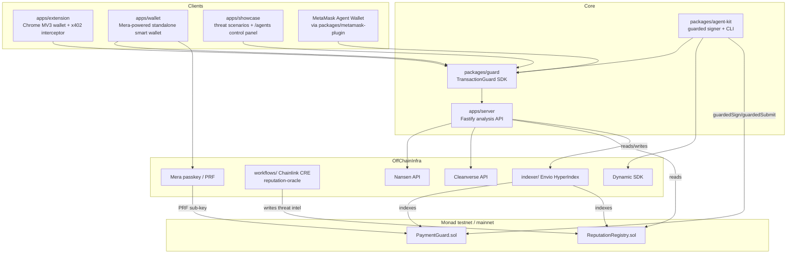

# Baret — System Architecture

> This document is the **target architecture** for the Baret implementation to be written from scratch for Monad Metropolis (no code yet). As code starts being written, this file must be kept in sync with the code — if a contradiction is found, the source code is treated as the authority and this file is updated.

Last updated: 2026-10-01 · Status: **`packages/guard`, the `apps/server` analysis core and both contracts are implemented and tested; Nansen/Cleanverse clients, Envio, CRE and agent-kit are not started**

---

## 1. Design Principles

1. **Monad only.** No file contains an "any EVM chain" / "point at any chain" generalization. `chain.ts` (or its equivalent) has exactly two entries: `testnet` (10143) and `mainnet` (143). No other chain's name appears anywhere.
2. **Fail-closed.** When there is insufficient data (simulation failed, account state missing), the decision falls on the **block** side, not "allow".
3. **SDKs can be consumed independently of the chain library.** Packages such as `@baret/guard` must be consumable without importing `ethers`/`viem` — wallet UIs should stay lightweight.
4. **Sponsor integrations are inside the product, not a separate "demo mode".** The Nansen, Cleanverse, Mera, Dynamic and Envio integrations are part of the main analysis flow; when switched off, the product genuinely loses capability.
5. **The policy belongs to the user, the engine to Baret.** `GuardPolicy` is carried entirely as data (JSON); the engine code interprets the policy but is not embedded in it.

---

## 2. High-Level Component Diagram


```mermaid
flowchart TB
    subgraph Clients
        EXT[apps/extension<br/>Chrome MV3 wallet + x402 interceptor]
        WAL[apps/wallet<br/>Mera-powered standalone smart wallet]
        SHOW[apps/showcase<br/>threat scenarios + /agents control panel]
        MM[MetaMask Agent Wallet<br/>via packages/metamask-plugin]
    end

    subgraph Core
        SDK[packages/guard<br/>TransactionGuard SDK]
        AGENT[packages/agent-kit<br/>guarded signer + CLI]
        API[apps/server<br/>Fastify analysis API]
    end

    subgraph OnChain["Monad testnet / mainnet"]
        PG[PaymentGuard.sol]
        RR[ReputationRegistry.sol]
    end

    subgraph OffChainInfra
        IDX[indexer/ Envio HyperIndex]
        CRE[workflows/ Chainlink CRE<br/>reputation-oracle]
        NANSEN[Nansen API]
        CLEAN[Cleanverse API]
        DYNAMIC[Dynamic SDK]
        MERA[Mera passkey / PRF]
    end

    EXT --> SDK
    WAL --> SDK
    SHOW --> SDK
    MM --> SDK
    AGENT --> SDK
    SDK --> API
    API --> NANSEN
    API --> CLEAN
    API -->|reads| RR
    API -->|reads/writes| IDX
    CRE -->|writes threat intel| RR
    WAL --> MERA
    AGENT --> DYNAMIC
    AGENT -->|guardedSign/guardedSubmit| PG
    MERA -->|PRF sub-key| PG
    IDX -->|indexes| PG
    IDX -->|indexes| RR
```

---

## 3. Monorepo Layout

```
baret/
├── apps/
│   ├── server/        Fastify + TypeScript analysis API (the heart of the engine)
│   ├── wallet/        Standalone smart wallet demo running on Mera passkeys
│   ├── extension/     Chrome MV3 (+ Firefox if possible) browser extension
│   └── showcase/      Threat scenario gallery + /agents control page
├── packages/
│   ├── guard/             @baret/guard — TransactionGuard + GuardPolicy SDK
│   ├── agent-kit/         @baret/agent-kit — guarded signer (Dynamic-backed) + CLI
│   ├── metamask-plugin/   MetaMask Agent Wallet plugin package for the Baret firewall
│   ├── wallet-adapter/    dApp ↔ wallet postMessage bridge
│   ├── ext-protocol/      Extension message-bus types
│   ├── ui/                Design tokens + shared React components
│   └── showcase-ui/       Shared UI skeleton for showcase sites
├── contracts/         Foundry — PaymentGuard.sol, ReputationRegistry.sol
├── workflows/         Chainlink CRE — reputation-oracle workflow
├── indexer/           Envio HyperIndex config + handlers
├── docs/              This documentation set
├── pnpm-workspace.yaml
└── docker-compose.yml / render.yaml / vercel.json (deploy config)
```

**Technology choices:**
- **Fastify** — API server (TypeScript).
- **viem** — Monad RPC interaction (D-012). `packages/guard` does not import it.
- **Zod** — env and request schema validation.
- **Foundry** — contract development/test/deploy.
- **React + Vite** — wallet/extension/showcase UIs.
- **Envio HyperIndex** — on-chain event indexing (GraphQL query surface).

---

## 4. Chain Configuration (Monad ONLY)

```ts
// apps/server/src/config/chains.ts — target shape
export const CHAINS = {
  testnet: {
    chainId: 10143,
    rpcUrl: process.env.MONAD_TESTNET_RPC_URL, // Alchemy primary
    explorerUrl: "https://testnet.monadexplorer.com",
    nativeSymbol: "MON",
    nativeDecimals: 18,
    usdcAddress: process.env.MONAD_TESTNET_USDC_ADDRESS, // to be verified during build, NO placeholder
    faucetUrl: "https://faucet.monad.xyz",
  },
  mainnet: {
    chainId: 143,
    rpcUrl: process.env.MONAD_MAINNET_RPC_URL,
    explorerUrl: "https://monadexplorer.com",
    nativeSymbol: "MON",
    nativeDecimals: 18,
    usdcAddress: process.env.MONAD_MAINNET_USDC_ADDRESS,
    faucetUrl: "",
  },
} as const;
```

> Note: Previous (non-Monad) implementations used generic env variables such as `RPC_URL`/`CHAIN_ID` to extend to "any EVM chain". In this project that is **deliberately reversed**: env variables are named `MONAD_TESTNET_*` / `MONAD_MAINNET_*`, and the code makes no "generic EVM chain" assumption anywhere.

---

## 5. Lifecycle of an Analysis Request

`POST /v1/analyze` — input (`analyzeRequestSchema` in `packages/guard/src/analyze.ts`):
`{ network, transaction | typedData, userWallet?, policy?, payment?, integratorRequestId? }`

- `transaction` is an unsigned call (`{ from, to, value, data, gas, ... }`) or a signed one (`{ raw }`).
- `typedData` is an EIP-712 message (`eth_signTypedData_v4`): permits, Permit2, and EIP-3009 transfer authorisations (x402).
- `policy` defaults to Balanced with the network's USDC as the only allowed payment asset.
- `payment` is the x402 context: what the merchant's 402 asked for (`origin`, `payTo`, `asset`, `amount`, `memo`) and the `spendHistory` the hourly and daily caps need.

```
[1] Rate limit (per IP) · [2] x-api-key when BARET_API_KEYS is set · [3] Zod body validation
     ↓  apps/server/src/application/analyze.ts
[4]  pin one block number; every read below is at that block
[5]  decodeTransaction()       call request or signed raw tx → normalized tx (chain id checked)
[6]  simulate                  eth_call + eth_estimateGas + debug_traceCall (callTracer, withLog)
[7]  effects                   approvals, transfers, ownership changes from the trace logs;
                               from the calldata when there is no trace or the call reverts;
                               from the message for typed data
[8]  addresses                 counterparties, recipients, touched contracts (eth_getCode),
                               EIP-1967 slot of every delegatecall source, balances, token metadata
[9]  sources                   Nansen + ReputationRegistry (reputation), Cleanverse (compliance)
[10] detectors                 risk/detectors/*.ts, pure functions of the context (§6)
[11] policy engine             policy/evaluate.ts: rule thresholds, then the decision (§7)
[12] response                  validated against analyzeResponseSchema before it is sent
     ↓
RESPONSE { decision, findings, firedRules, suggestions, confidence, estimatedChanges,
           approvals, sources, expiresAt, meta }
```

- `decision`: `safe` (no findings), `caution` (findings, none blocking), `blocked`.
- `findings[]`: `{ code, severity, values, blocking, details? }`. Compliance findings carry `details.side` (`self` or `recipient`).
- `firedRules[]`: `{ rule, code, limit, actual }` for every blocking finding.
- `suggestions[]`: `{ code, values }`; today only `ERC20_APPROVAL_UNLIMITED` with the amount this same request spends.
- `estimatedChanges[]`: the user's balance changes in base units (`before`, `after`, `delta`), MON includes the fee for the whole gas limit.
- `sources[]`: `alchemy`, `nansen`, `reputation-registry`, `cleanverse`, each `ok`, `unavailable` or `skipped`.
- RPC outage: HTTP 503 `rpc_unavailable`, never a verdict. The client shows "Can't reach Baret" (Blocked).

---

## 6. Risk Detectors

| Detector | File (target) | What it catches | Example finding codes |
|---|---|---|---|
| simulation | `risk/detectors/simulation.ts` | Simulation failed, calldata-only (no trace) | `SIMULATION_FAILED`, `LOW_CONFIDENCE_INCOMPLETE_DATA` |
| approvals | `risk/detectors/approvals.ts` | Unlimited `approve`, `setApprovalForAll`, EIP-2612 `permit` | `ERC20_APPROVAL_GRANTED`, `ERC20_APPROVAL_UNLIMITED`, `NFT_OPERATOR_GRANTED`, `PERMIT_SIGNATURE_DETECTED` |
| programs | `risk/detectors/programs.ts` | Contract on the risky list / unknown contract | `RISKY_CONTRACT_INTERACTION`, `UNKNOWN_CONTRACT_EXPOSURE` |
| evm-danger | `risk/detectors/evm-danger.ts` | `SELFDESTRUCT`, `DELEGATECALL`, ownership transfer | `SELFDESTRUCT_CALL`, `DELEGATECALL_DETECTED`, `OWNERSHIP_TRANSFER` |
| reputation | `risk/detectors/reputation.ts` | Nansen labels + on-chain ReputationRegistry | `KNOWN_MALICIOUS_ADDRESS`, `NANSEN_FLAGGED_FRESH_WALLET`, `NANSEN_FLAGGED_WHALE_COUNTERPARTY`, `NANSEN_TRUST_BELOW_MINIMUM`, `REPUTATION_DATA_UNAVAILABLE` |
| compliance | `risk/detectors/compliance.ts` **(new)** | Transfer that has not passed Cleanverse CVI verification | `COMPLIANCE_NO_CREDENTIAL`, `COMPLIANCE_EXPIRED`, `COMPLIANCE_TIER_INSUFFICIENT`, `COMPLIANCE_COUNTRY_DISALLOWED`, `COMPLIANCE_DATA_UNAVAILABLE` |
| cpi | `risk/detectors/cpi.ts` | Deep internal-call nesting, high operation count | `DEEP_CALL_NESTING`, `HIGH_OPERATION_COUNT` |
| compute | `risk/detectors/compute.ts` | Excessive gas ceiling | `EXCESSIVE_GAS` |
| x402 | `risk/detectors/x402.ts` | Missing memo, asset outside the allowlist, destination/asset mismatch | `X402_DESTINATION_MISMATCH`, `X402_ASSET_MISMATCH`, `X402_NON_CANONICAL_ASSET`, `X402_MEMO_MISSING`, `X402_ASSET_NOT_ALLOWED` |
| policy engine | `policy/evaluate.ts` | Rule thresholds that need the user's limits or spend history: loss limits, balance floors, x402 caps and merchant allowlist | `ESTIMATED_LOSS_EXCEEDS_MAX`, `LOSS_PERCENT_UNAVAILABLE`, `POST_BALANCE_TOO_LOW`, `POST_BALANCE_UNAVAILABLE`, `X402_PER_TX_CAP_EXCEEDED`, `X402_HOURLY_CAP_EXCEEDED`, `X402_DAILY_CAP_EXCEEDED`, `X402_MERCHANT_NOT_ALLOWED`, `X402_SPEND_HISTORY_UNAVAILABLE` |

Every finding: `{ code, severity: low|medium|high|critical, values, details? }`. The server sends the code and the values to interpolate, never a sentence: the words, the placeholders each code takes and the emitter of each code live in `packages/content/src/shared/findings.content.ts`, which is the contract (38 codes). Each `GuardPolicy` field lists the codes it can produce in `packages/content/src/shared/policy.content.ts`. The `*_UNAVAILABLE` codes are the fail-closed branches: when a data source does not answer, the check fails instead of passing.

---

## 7. Policy Engine

`GuardPolicy` — pure data, ~20 independent on/off + threshold fields:

| Category | Fields |
|---|---|
| Simulation | `requireSuccessfulSimulation` |
| Contract | `blockRiskyContracts`, `blockUnknownContractExposure` |
| Approval | `blockUnlimitedApprovals`, `blockSetApprovalForAll`, `blockPermit` |
| Dangerous opcodes | `blockSelfdestruct`, `blockDelegatecall`, `blockOwnershipTransfer` |
| Loss limits | `maxLossPercent`, `minPostUsdcBalance`, `minPostNativeBalance` |
| Reputation | `blockKnownMalicious`, `minNansenTrustLevel` |
| Compliance | `requireComplianceCheck`, `allowedCountries`, `minComplianceTier` |
| Resources | `maxGas` |
| x402 | `requireMemo`, `maxPerTxCap`, `maxHourlyCap`, `maxDailyCap`, `allowedAssets`, `allowedMerchantOrigins` |
| General | `allowWarnings` |

**Ready-made templates:** `STRICT_POLICY`, `BALANCED_POLICY` (production default), `PERMISSIVE_POLICY` — `packages/guard/src/policy-templates.ts`.

**The decision logic is fail-closed:** if the loss cannot be computed, if compliance data cannot be fetched, if the reputation API is unreachable → block.

**How each code is decided** (`FINDING_SPECS` in `packages/guard/src/findings.ts`, tested against `policy.content.ts`):

| Kind | Codes | Blocks when |
|---|---|---|
| toggle | `SIMULATION_FAILED`, approvals, contracts, dangerous calls, `KNOWN_MALICIOUS_ADDRESS` | its boolean field is on; otherwise it is a warning |
| threshold | Nansen trust, compliance, gas, loss, floors, x402 assets/memo/merchant/caps | always (the emitter only fires when the rule is set and broken) |
| failClosed | every `*_UNAVAILABLE` | always, and only emitted when a rule needed the missing data |
| warning | `LOW_CONFIDENCE_INCOMPLETE_DATA`, `ERC20_APPROVAL_GRANTED`, fresh wallet, whale, nesting, operation count, `X402_DESTINATION_MISMATCH`, `X402_ASSET_MISMATCH` | `allowWarnings` is off |

Severity is display only; it never decides. A delegatecall from a standard EIP-1967 proxy to its own implementation is not reported (USDC is such a proxy).

---

## 8. Component Details

### 8.1 `apps/server`
The entire analysis engine lives here. Endpoints:

| Method | Path | Description |
|---|---|---|
| GET | `/health`, `/health/ready` | Liveness / is the RPC ready |
| POST | `/v1/analyze` | Single transaction analysis |
| POST | `/v1/analyze/batch` | ≤25 transactions |
| POST | `/v1/analyze/stream` | SSE result stream |
| POST | `/v1/replay` | Re-simulation |
| GET | `/v1/audit/recent`, `/aggregate`, `/contract/:address` | Audit (Envio-backed) |
| GET/POST | `/mcp/tools`, `/mcp/call` | AI agent tools |
| GET | `/demo/paywall` | x402 demo (see `X402_FACILITATOR.md`) |

Implemented: `/health`, `/health/ready`, `/v1/analyze`. The other routes are not started.

MCP tools: `baret_analyze`, `baret_health`, `baret_list_profiles`, `baret_explain` (LLM-backed plain-language explanation — KIMI/Qwen).

### 8.2 `apps/wallet` — Mera-powered standalone wallet
- Account creation with a passkey (no seed phrase).
- Flow for deriving an agent sub-key from Mera's PRF-derived key material.
- Visual policy editor (`Policies` page) — pick a template, then adjust each rule individually.
- Analysis via `@baret/guard` before every signature.

### 8.3 `apps/extension` — Chrome MV3
- EIP-1193 / EIP-6963 provider.
- `background`: account state machine, IndexedDB (keystore, history, allowances, site permissions), chain monitor (WebSocket — not polling, per the Alchemy recommendation in notes.txt).
- `inpage`: `window.ethereum` provider + x402 fetch interceptor.
- Every signature request goes through the guard; a risky transaction is blocked in the wallet, not in the dApp.

### 8.4 `apps/showcase`
- Six threat scenarios (fake dApps with safe/danger variants): SCRYBE, NOVASWAP, PIXELDROP, ORBITYIELD, CLAIMHUB, LAUNCHPAD. The names are kept from the earlier version by decision D-010.
- `/agents` page: live playground for agent-kit + PaymentGuard + (if available) the Qwen adversarial reviewer.

### 8.5 `packages/guard`
`TransactionGuard.evaluate({ transaction, userWallet, policy })` → `{ decision, blockingReasons, analysis }`. **Never signs/submits** — only returns a decision.

### 8.6 `packages/agent-kit`
`AgentWallet` class: `evaluate()`, `guardedSign()`, `guardedSubmit()`. Agent/server wallet creation and delegated permission management with the Dynamic SDK. CLI: `baret analyze | sign | submit | address | policy list`. Exit codes: `0` allow, `1` policy block, `2` error.

### 8.7 `packages/metamask-plugin`
A separate package that wraps Baret's guard/policy engine in the MetaMask Agent Wallet plugin manifest format. Limited to read-only + tx-request-proposing permissions; it cannot bypass the agent-wallet policy engine (a condition of the bounty).

---

## 9. Environment Variables

The authoritative list is `apps/server/.env.example`, validated by `apps/server/src/config/env.ts` at start-up.

| Variable | Required | Description |
|---|---|---|
| `MONAD_TESTNET_RPC_URL` | Yes | Monad testnet RPC for every read, sent as JSON-RPC batches (Alchemy) |
| `MONAD_TESTNET_TRACE_RPC_URL` | No | Node for `debug_traceCall` when the main RPC lacks it (Alchemy's free tier does): the public `https://testnet-rpc.monad.xyz`. Unset: the main RPC traces |
| `MONAD_TESTNET_USDC_ADDRESS` | For USDC rules and x402 | Canonical USDC, verified on the explorer. Unset: USDC floor fails closed, default policy allows no payment asset |
| `MONAD_TESTNET_REPUTATION_REGISTRY_ADDRESS` | For reputation rules | Deployed `ReputationRegistry`. Unset: rules that need it fail closed |
| `MONAD_TESTNET_KNOWN_CONTRACTS` | No | Comma-separated contracts Baret vouches for (PaymentGuard, showcase contracts) |
| `MONAD_MAINNET_*` | No | Same four for mainnet; mainnet is served only when its RPC URL is set |
| `BARET_API_KEYS` | No | Comma-separated keys for `/v1` (`x-api-key`). Empty: open, development only |
| `BARET_CORS_ORIGINS` | No | Comma-separated origins. Empty: any |
| `BARET_RATE_LIMIT_PER_MINUTE` / `BARET_REQUEST_TIMEOUT_MS` / `BARET_VERDICT_TTL_SECONDS` | No | 120 / 8000 / 30 |
| `NANSEN_API_KEY` / `NANSEN_MODE` | For the trust-level rule; adds to the blocklist | `sources/nansen.ts` (D-016, D-017). `funder` (default): `profiler/address/first-funder`, 1 credit per wallet. `labels`: `profiler/address/labels`, 100 credits. Unset: only `minNansenTrustLevel` above `new` fails closed |
| `CLEANVERSE_API_KEY` / `CLEANVERSE_API_URL` | For compliance rules | Client not wired yet (Week 3) |
| `X402_*`, `ENVIO_ENDPOINT`, `DYNAMIC_ENVIRONMENT_ID`, `MERA_*`, `QWEN_API_KEY`, `KIMI_API_KEY` | Later | Added when their module is built |

Contracts deploy (`contracts/script/Deploy.s.sol`): `BARET_OWNER`, `BARET_CRE_FORWARDER`, `MONAD_TESTNET_USDC_ADDRESS`, deployer key passed on the command line, never stored.

---

## 10. Explicit Non-Goals

- No generic "works on every EVM chain" configuration.
- No going back to a non-persistent (in-memory only) audit trail — the Envio indexer is the primary source.
- The smart wallet address will not be left as a placeholder (a known gap in the previous repos) — a real account via the Mera integration.
