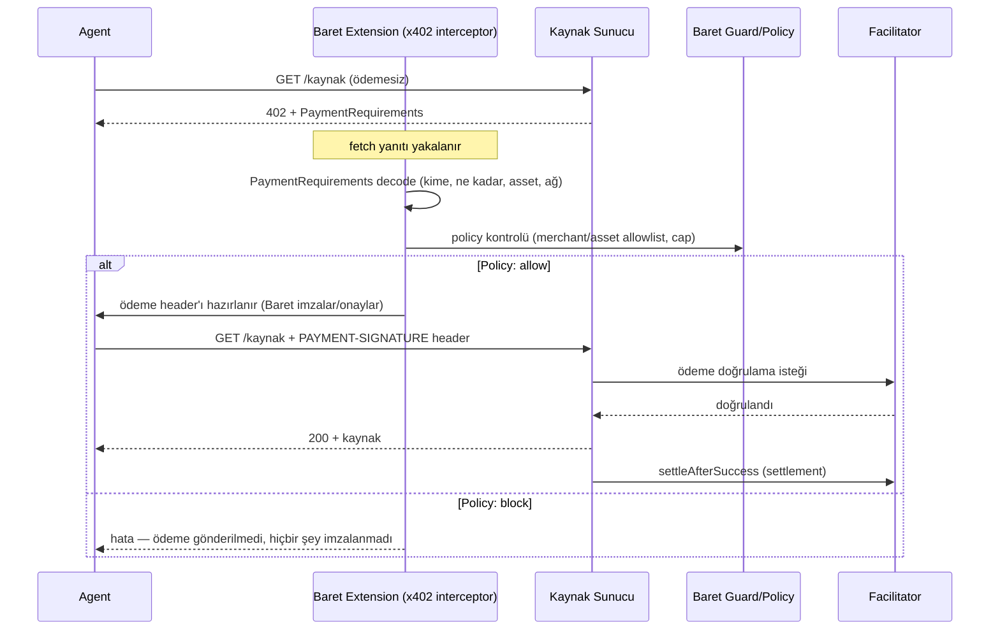

# Baret — x402 & Facilitator Tasarımı

> HTTP 402 tabanlı mikro-ödeme akışının Baret içindeki uygulaması. Amaç: bir AI agent'ın 402 yanıtına **kör imza atmasını** engellemek — her ödeme, gönderilmeden önce decode edilip policy'den geçer.

Son güncelleme: 2026-09-13 · Durum: **Tasarım aşaması**

---

## 1. x402 Nedir (kısa)

Bir API, ödeme yapılmadan erişilmek istendiğinde `402 Payment Required` + `PaymentRequirements` (kime, ne kadar, hangi asset, hangi ağ) döner. İstemci (genelde bir AI agent) bu bilgiyi kullanarak ödeme yapar ve isteği tekrar gönderir. Varsayılan davranışta agent bu bilgiyi **kimseye göstermeden** otomatik öder — Baret'in çözdüğü tam olarak bu kör-imza problemidir (bkz. `PROJECT_OVERVIEW.md` §2, `notes-2.txt`: "No one's going out there and pasting private keys around anymore").

## 2. Roller

| Rol | Sorumluluk |
|---|---|
| **Kaynak sunucu (resource server)** | Korunan API'yi sunar, ödemesiz istekte 402 döner |
| **İstemci / Agent** | Ödeme yapıp isteği tekrar gönderir — Baret extension'ı bu adımı yakalar |
| **Facilitator** | Ödeme kanıtını (payment signature/header) doğrulayan ve zincire yazan/settlement yapan aracı servis |
| **Baret x402 interceptor** | `fetch`'i 402 anında yakalar, `PaymentRequirements`'ı decode eder, policy kontrolünden geçirir |
| **Baret policy engine** | Merchant allowlist, asset allowlist, per-tx/saatlik/günlük cap kontrolü |

## 3. Akış (sequence)



## 4. Baret Tarafında Uygulama

### 4.1 Extension interceptor
`apps/extension/src/inpage/x402-interceptor.ts` (hedef dosya) — sayfanın `fetch` çağrılarını sarar, `402` status kodunu yakalar, gövdedeki `PaymentRequirements`'ı parse eder.

### 4.2 Server tarafı risk dedektörü
`apps/server/src/risk/detectors/x402.ts` — gerçekleşen ödeme transaction'ını, sunucunun **gerçekte istediği** `PaymentRequirements` ile çapraz kontrol eder:

| Bulgu kodu | Anlamı |
|---|---|
| `X402_MEMO_MISSING` | Politika memo zorunlu kılıyor ama yok |
| `X402_NON_CANONICAL_ASSET` | Ödeme, allowlist dışı bir asset ile yapılmaya çalışılıyor |
| `X402_DESTINATION_MISMATCH` | Ödemenin gittiği adres, sunucunun istediğinden farklı |
| `X402_ASSET_MISMATCH` | Asset uyuşmazlığı (ör. USDC yerine başka token) |

### 4.3 Policy alanları (`GuardPolicy.x402`)
```ts
{
  requireMemo: boolean;
  allowedAssets: string[];          // 0x adres listesi
  allowedMerchantOrigins: string[]; // izin verilen alıcı/merchant origin'leri
  maxPerTxCap: string;              // tek ödeme tavanı
  maxHourlyCap: string;
  maxDailyCap: string;
}
```
Bu alanlar `PaymentGuard.sol`'daki `setMerchantCap` ile **kavramsal olarak aynı model** — off-chain (extension seviyesi, insan kullanıcı için) ve on-chain (agent/otonom kullanım için) iki katman aynı politika dilini konuşur.

### 4.4 Facilitator
- Hackathon kapsamında kendi facilitator'ımızı yazmak yerine (zaman kısıtı), önce **standart x402 facilitator** kullanılacak; kendi facilitator'ımızı yazmak gerekirse (ör. Monad'a özel doğrulama mantığı için) bu karar `DECISIONS.md`'ye eklenecek.
- Facilitator URL, ağ kimliği: **`eip155:10143`** (Monad testnet) / **`eip155:143`** (mainnet) — CAIP-2 formatı, başka zincir referansı yok.
- Env: `X402_ENABLED`, `X402_PAY_TO` (Monad adresi), `X402_FACILITATOR_URL`, `X402_NETWORK`, `X402_ANALYZE_PRICE`.

### 4.5 Demo Endpoint
`GET /demo/paywall?q=...` — showcase'deki bir demo senaryosunu (eski repolardaki "scrybe" konseptinin Monad-temalı yeniden adlandırılmış hali — isim `DECISIONS.md`'de netleşecek) besler: ödemesiz istek → 402 → Baret ödemeyi decode edip onaylıyor/reddediyor → başarılıysa cevap + on-chain kanıt.

## 5. Test / Demo Planı

- [ ] Mutlu yol: allowlist'teki bir merchant'a, cap içinde bir ödeme — otomatik geçer.
- [ ] Red yolu: allowlist dışı asset — `X402_NON_CANONICAL_ASSET`, ödeme gönderilmez.
- [ ] Red yolu: hedef adres uyuşmazlığı (sahte 402 yanıtı simüle edilir) — `X402_DESTINATION_MISMATCH`.
- [ ] Cap aşımı: saatlik limiti aşan art arda istekler — bloklanır.
- [ ] Bu dört senaryo demo videosunda gösterilir (notes-2.txt: "adversarial layer... personal CFO agent" anlatısını görselleştirir).

## 6. Açık Kararlar

- Kendi facilitator'ımızı mı yazacağız yoksa mevcut birini mi kullanacağız? → `DECISIONS.md`'de karar bekleniyor.
- Demo senaryosunun adı (eski "scrybe" yerine) → `DECISIONS.md`'de karar bekleniyor.
