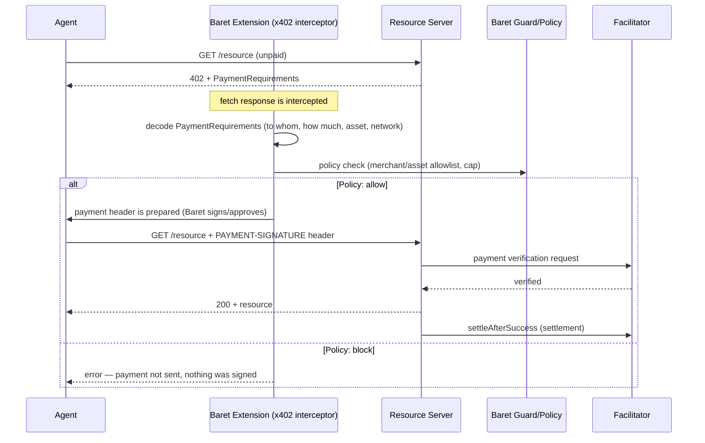

# Baret — x402 & Facilitator Design

> The implementation of the HTTP 402-based micropayment flow inside Baret. Goal: prevent an AI agent from **blind-signing** a 402 response — every payment is decoded and passed through the policy before it is sent.

Last updated: 2026-09-13 · Status: **Design phase**

---

## 1. What is x402 (short)

When an API is accessed without payment, it returns `402 Payment Required` + `PaymentRequirements` (to whom, how much, which asset, which network). The client (usually an AI agent) uses this information to pay and re-sends the request. In the default behavior the agent pays automatically **without showing this information to anyone** — this blind-signing problem is exactly what Baret solves (see `PROJECT_OVERVIEW.md` §2, `notes-2.txt`: "No one's going out there and pasting private keys around anymore").

## 2. Roles

| Role | Responsibility |
|---|---|
| **Resource server** | Serves the protected API, returns 402 on an unpaid request |
| **Client / Agent** | Pays and re-sends the request — the Baret extension intercepts this step |
| **Facilitator** | Intermediary service that verifies the payment proof (payment signature/header) and writes it on-chain / performs settlement |
| **Baret x402 interceptor** | Intercepts `fetch` at the moment of the 402, decodes `PaymentRequirements`, runs it through the policy check |
| **Baret policy engine** | Merchant allowlist, asset allowlist, per-tx/hourly/daily cap checks |

## 3. Flow (sequence)



## 4. Implementation on the Baret Side

### 4.1 Extension interceptor
`apps/extension/src/inpage/x402-interceptor.ts` (target file) — wraps the page's `fetch` calls, catches the `402` status code, parses the `PaymentRequirements` in the body.

### 4.2 Server-side risk detector
`apps/server/src/risk/detectors/x402.ts` — cross-checks the actual payment transaction against the `PaymentRequirements` the server **actually requested**:

| Finding code | Meaning |
|---|---|
| `X402_MEMO_MISSING` | The policy requires a memo but there is none |
| `X402_NON_CANONICAL_ASSET` | The payment is being attempted with an asset outside the allowlist |
| `X402_DESTINATION_MISMATCH` | The address the payment goes to differs from what the server requested |
| `X402_ASSET_MISMATCH` | Asset mismatch (e.g. a different token instead of USDC) |

### 4.3 Policy fields (`GuardPolicy.x402`)
```ts
{
  requireMemo: boolean;
  allowedAssets: string[];          // list of 0x addresses
  allowedMerchantOrigins: string[]; // allowed recipient/merchant origins
  maxPerTxCap: string;              // single payment ceiling
  maxHourlyCap: string;
  maxDailyCap: string;
}
```
These fields are **conceptually the same model** as `setMerchantCap` in `PaymentGuard.sol` — the two layers, off-chain (extension level, for the human user) and on-chain (for agent/autonomous use), speak the same policy language.

### 4.4 Facilitator
- Within the hackathon scope, instead of writing our own facilitator (time constraint), the **standard x402 facilitator** will be used first; if writing our own facilitator becomes necessary (e.g. for Monad-specific verification logic), that decision will be added to `DECISIONS.md`.
- Facilitator URL, network identifier: **`eip155:10143`** (Monad testnet) / **`eip155:143`** (mainnet) — CAIP-2 format, no reference to any other chain.
- Env: `X402_ENABLED`, `X402_PAY_TO` (Monad address), `X402_FACILITATOR_URL`, `X402_NETWORK`, `X402_ANALYZE_PRICE`.

### 4.5 Demo Endpoint
`GET /demo/paywall?q=...` — feeds a demo scenario in the showcase (the Monad-themed, renamed version of the "scrybe" concept from the old repos — the name will be settled in `DECISIONS.md`): unpaid request → 402 → Baret decodes the payment and approves/rejects it → on success, the response + on-chain proof.

## 5. Test / Demo Plan

- [ ] Happy path: a payment within the cap to a merchant on the allowlist — passes automatically.
- [ ] Rejection path: asset outside the allowlist — `X402_NON_CANONICAL_ASSET`, payment is not sent.
- [ ] Rejection path: destination address mismatch (a fake 402 response is simulated) — `X402_DESTINATION_MISMATCH`.
- [ ] Cap overflow: consecutive requests exceeding the hourly limit — blocked.
- [ ] These four scenarios are shown in the demo video (notes-2.txt: visualizes the "adversarial layer... personal CFO agent" narrative).

## 6. Open Decisions

- Will we write our own facilitator or use an existing one? → Decision pending in `DECISIONS.md`.
- The name of the demo scenario (replacing the old "scrybe") → Decision pending in `DECISIONS.md`.
